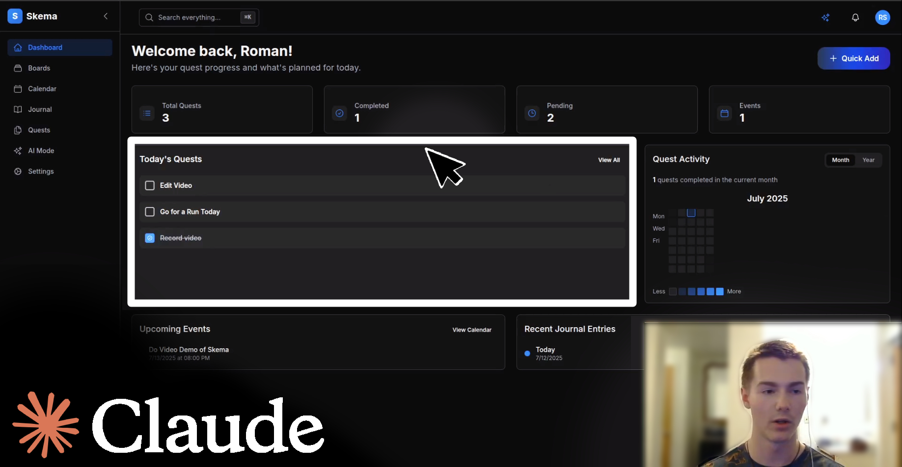

# UltraThink V2 | By [Roman Slack](https://github.com/romanslack)

**Claude Code Prompt Structure: Handles all task complexities, from one-shot simple to ~80% on large projects.**

## Video Demo: Product Built with UltraThinkV2

<a href="https://www.youtube.com/watch?v=WxA-utyliIw" target="_blank">Click here to watch video on YouTube</a>

Here is a website showing how to utilize UltraThinkV2:
<a href="https://adorable-scone-e041b8.netlify.app/" target="_blank">https://adorable-scone-e041b8.netlify.app/</a>

**Website Preview:**

Diagram of my pipeline (I have used this to sell SaaS projects):

Original UltraThink source:
<a href="https://www.reddit.com/r/ClaudeAI/comments/1lpvj7z/ultrathink_task_command" target="_blank">https://www.reddit.com/r/ClaudeAI/comments/1lpvj7z/ultrathink_task_command</a>
